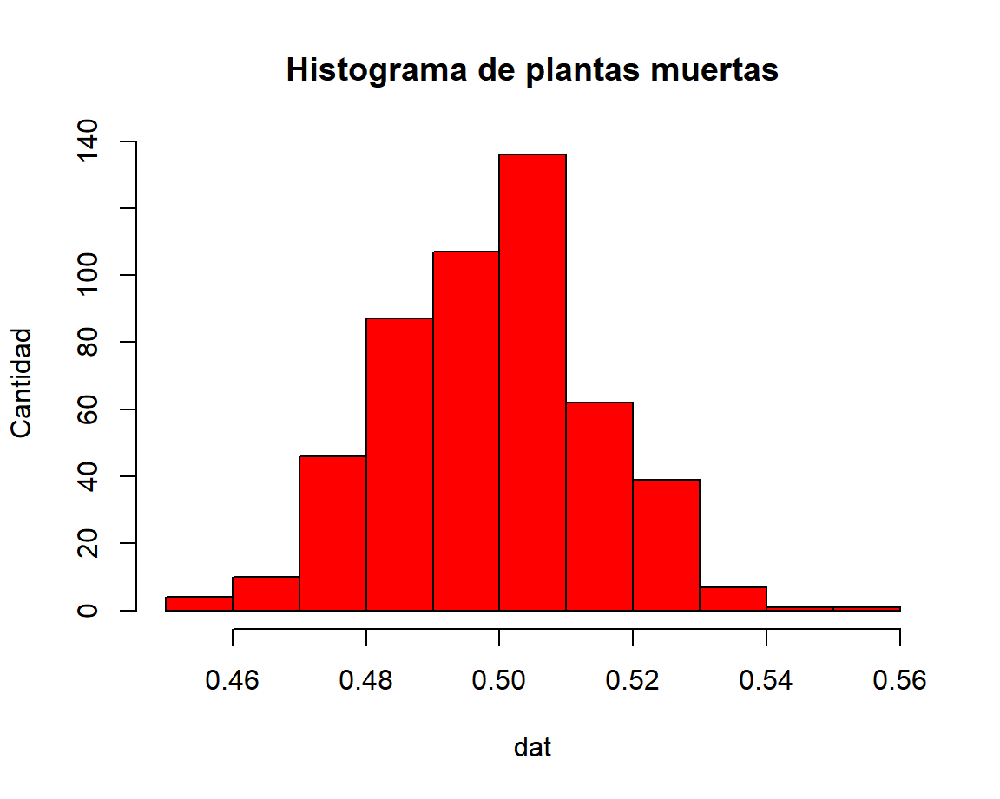

<div class="knitr-options" data-fig-width="576" data-fig-height="460"></div>


Column {data-width=40 }
--------------------------------------------

### Poblacion {.value-box}

<div class="knitr-options" data-fig-width="576" data-fig-height="460"></div>

```{=html}
<span class="value-output" data-caption="Poblacion" data-icon="fa-solid fa-medal" data-color="#AA0000" data-color-text="#fff" data-color-icon="#620d0d">1000</span>
```


### Muestra  {.value-box}
<div class="knitr-options" data-fig-width="576" data-fig-height="460"></div>

```{=html}
<span class="value-output" data-caption="Muestra" data-icon="fa-solid fa-medal" data-color="#AA0000" data-color-text="#fff" data-color-icon="#620d0d">500</span>
```


Column {data-width=650 .tabset}
-----------------------------------------------------------------------
### Histograma
**Sesgo y Varianza** 
med_pob
<div class="knitr-options" data-fig-width="576" data-fig-height="460"></div>


### Chart B

<div class="knitr-options" data-fig-width="576" data-fig-height="460"></div>


Column {data-width=350}
-----------------------------------------------------------------------

### Chart C

<div class="knitr-options" data-fig-width="576" data-fig-height="460"></div>


### Chart D

<div class="knitr-options" data-fig-width="576" data-fig-height="460"></div>


